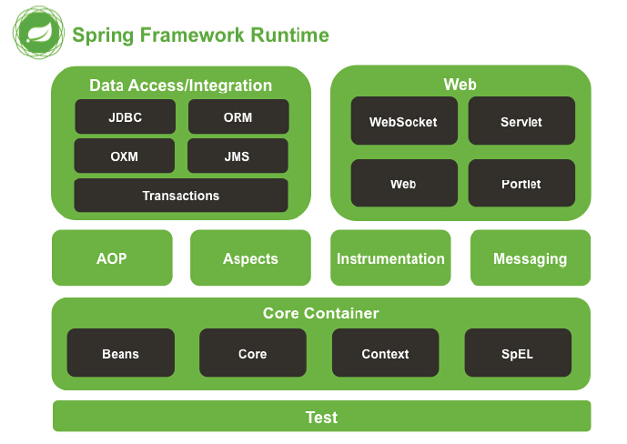
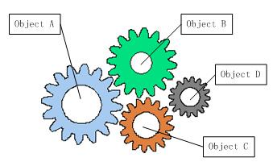
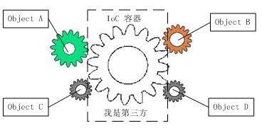
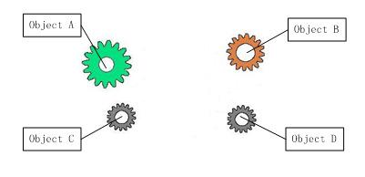
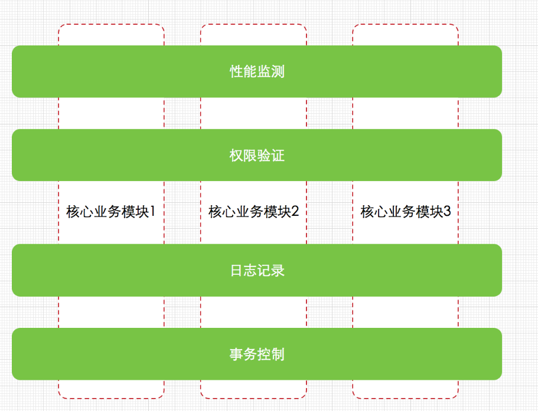
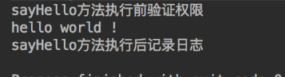
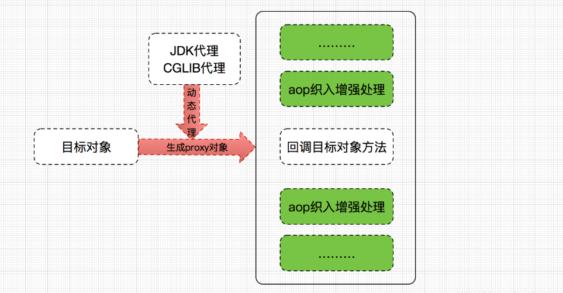
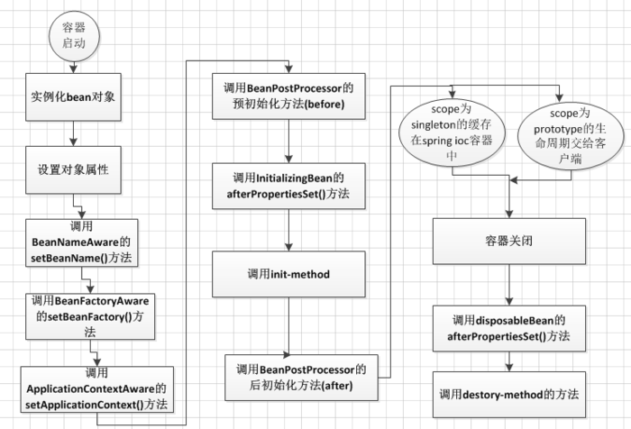

  * [Spring入门第一步](#spring%E5%85%A5%E9%97%A8%E7%AC%AC%E4%B8%80%E6%AD%A5)
    * [Spring是什么](#spring%E6%98%AF%E4%BB%80%E4%B9%88)
      * [◆轻量——](#%E8%BD%BB%E9%87%8F)
      * [◆控制反转——](#%E6%8E%A7%E5%88%B6%E5%8F%8D%E8%BD%AC)
      * [◆面向切面——](#%E9%9D%A2%E5%90%91%E5%88%87%E9%9D%A2)
      * [◆容器——](#%E5%AE%B9%E5%99%A8)
    * [Spring 的作用](#spring-%E7%9A%84%E4%BD%9C%E7%94%A8)
    * [Spring的结构](#spring%E7%9A%84%E7%BB%93%E6%9E%84)
      * [AOP and Instrumentation（Spring的另一重大特性）](#aop-and-instrumentationspring%E7%9A%84%E5%8F%A6%E4%B8%80%E9%87%8D%E5%A4%A7%E7%89%B9%E6%80%A7)
    * [Spring IOC（Inversion of Control控制反转，重头戏！）](#spring-iocinversion-of-control%E6%8E%A7%E5%88%B6%E5%8F%8D%E8%BD%AC%E9%87%8D%E5%A4%B4%E6%88%8F)
      * [什么是IOC](#%E4%BB%80%E4%B9%88%E6%98%AFioc)
      * [IOC的实现—DI(Dependency Injection 依赖注入)](#ioc%E7%9A%84%E5%AE%9E%E7%8E%B0didependency-injection-%E4%BE%9D%E8%B5%96%E6%B3%A8%E5%85%A5)
    * [Spring AOP](#spring-aop)
      * [什么是AOP](#%E4%BB%80%E4%B9%88%E6%98%AFaop)
      * [AOP的实现-AspectJ](#aop%E7%9A%84%E5%AE%9E%E7%8E%B0-aspectj)
      * [AOP的实现- Spring AOP](#aop%E7%9A%84%E5%AE%9E%E7%8E%B0--spring-aop)
      * [Spring AOP的实现原理](#spring-aop%E7%9A%84%E5%AE%9E%E7%8E%B0%E5%8E%9F%E7%90%86)
    * [Spring配置文件](#spring%E9%85%8D%E7%BD%AE%E6%96%87%E4%BB%B6)
      * [如何在项目中加入Spring](#%E5%A6%82%E4%BD%95%E5%9C%A8%E9%A1%B9%E7%9B%AE%E4%B8%AD%E5%8A%A0%E5%85%A5spring)
      * [如何配置一个Bean](#%E5%A6%82%E4%BD%95%E9%85%8D%E7%BD%AE%E4%B8%80%E4%B8%AAbean)
    * [Spring Bean](#spring-bean)
      * [Bean 的创建：](#bean-%E7%9A%84%E5%88%9B%E5%BB%BA)
      * [Bean 的作用域](#bean-%E7%9A%84%E4%BD%9C%E7%94%A8%E5%9F%9F)
      * [Bean 的生命周期](#bean-%E7%9A%84%E7%94%9F%E5%91%BD%E5%91%A8%E6%9C%9F)
    * [Spring的缺陷](#spring%E7%9A%84%E7%BC%BA%E9%99%B7)

Spring入门第一步
===========

Spring是什么
------------

spring是一个**轻量**级的**控制反转(IoC)**和**面向切面(AOP)**的**容器**框架。

### **◆轻量**——

从大小与开销两方面而言Spring都是轻量的。完整的Spring框架在一个大小1MB多的JAR文件里发布。并且Spring所需的处理开销也是微不足道的。

### **◆控制反转**——

Spring通过一种称作控制反转（IoC）的技术促进了松耦
合。IOC的具体概念会在下文进行详细解释

### <br>**◆面向切面**——

Spring提供了面向切面编程的丰富支持，允许通过分离应用的
业务逻辑与系统级服务进行内聚性的开发。AOP的具体概念会在下文进行详细解释

### **◆容器**——

Spring包含并管理应用对象（Bean）的配置和生命周期，在这个意义上它是
一种容器，你可以配置你的每个bean如何被创建——基于一个可配置原型（prototype），你的bean可以创建一个单独的实例或者每次需要时都生成一个新的实例——以及它们是如何相互关联的。

Spring 的作用
-------------

Spring的使用范围包括普通的JAVA程序也可用于Web开发

Spring的主要作用分别为IOC、AOP

Spring的结构
------------



**Core Container：**

spring-core和spring-beans提供了 Spring 框架的基本功能，包括控制反转（Inversion
of Control，简称IOC）和依赖注入（Dependency
Injection简称DI）的特性。（Spring最最最最重要的东西）

**核心容器（敲黑板！开篇说Spring是个容器就是因为这个东西，大家的小眼睛看清楚了！！！）**的主要组件是**BeanFactory**，它是工厂模式的实现。BeanFactory将应用程序的配置和依赖性规范与实际的应用程序代码分开。

spring-context是一个配置文件，向 Spring 框架提供上下文信息。

### AOP and Instrumentation（Spring的另一重大特性）

Spring AOP 模块直接将面向方面的编程功能集成到了 Spring 框架中。

单独的spring-aspects模块用来支持与AspectJ的集成。

spring-instrument模块提供在特定的应用程序服务器类加载器实现。

Spring IOC（Inversion of Control控制反转，重头戏！）
----------------------------------------------------

### 什么是IOC

未使用Spring之前，组件之间的协调关系是由程序内部代码来控制的，或者说，以前我们使用New关键字来实现两组间之间的**依赖关系**的。（忘记什么叫依赖关系的同学可以找一下UML图中的依赖关系）

这种方式就造成了组件之间的互相耦合。IOC就是来解决这个问题的，它将实现组件间的关系从程序内部提到外部容器来管理。也就是说，由容器在运行期将组件间的某种依赖关系动态的注入组件中。

不明白耦合的同学看这里\~明白的往下跳：



齿轮组中齿轮之间的啮合关系,与软件系统中对象之间的耦合关系非常相似

既然有耦合，那么就有松耦合：


我们再把中间的IOC容器当作透明不看



这样的话我们在开发过程中只要注重当前的一个Object就行了，不用去管如何与其他的Object进行依赖

### IOC的实现—DI(Dependency Injection 依赖注入)

定义：**依赖注入**就是将实例变量传入到一个对象中去

什么是依赖

如果在 Class A 中，有 Class B 的实例，则称 Class A 对 Class B
有一个依赖。例如下面类 Human 中用到一个 Father 对象，我们就说类 Human 对类
Father 有一个依赖。
```
public class Human {

...

Father father;

...

public Human() {

father = new Father();

}

}
```
仔细看这段代码我们会发现存在一些问题：

1.  如果现在要改变 father 生成方式，如需要用new Father(String name)初始化
    father，需要修改 Human 代码；

2.  如果想测试不同 Father 对象对 Human 的影响很困难，因为 father
    的初始化被写死在了 Human 的构造函数中；

3.  如果new Father()过程非常缓慢，单测时我们希望用已经初始化好的 father
    对象模仿这个过程也很困难。

上面将依赖在构造函数中直接初始化是一种 Hard init
方式，弊端在于两个类不够独立，不方便测试。我们还有另外一种 Init 方式，如下：
```
public class Human {


Father father;


public Human(Father father) {

this.father = father;

}

}
```
上面代码中，我们将 father 对象作为构造函数的一个参数传入。在调用 Human
的构造方法之前外部就已经初始化好了 Father
对象。像这种**非自己主动初始化依赖，而通过外部来传入依赖的方式，我们就称为依赖注入。**  
现在我们发现上面 1
中存在的两个问题都很好解决了，简单的说依赖注入主要有两个好处：

1.  解耦，将依赖之间解耦。

2.  因为已经解耦，所以方便做单元测试，尤其是 模拟测试。

附上一篇博客：<https://blog.csdn.net/javazejian/article/details/54561302>

Spring AOP
----------

### 什么是AOP

一张图让你明白AOP （Aspect Oriented Programming 面向切面编程）



每个关注点与核心业务模块分离，作为单独的功能，横切几个核心业务模块，这样的做的好处是显而易见的，每份功能代码不再单独入侵到核心业务类的代码中，即核心模块只需关注自己相关的业务，当需要外围业务(日志，权限，性能监测、事务控制)时，这些外围业务会通过一种特殊的技术自动应用到核心模块中，这些关注点有个特殊的名称，叫做“横切关注点”，上图也很好的表现出这个概念，这种抽象级别的技术就叫AOP（面向切面编程）

### AOP的实现-AspectJ
```
public class HelloWord {

    public void sayHello(){
        System.out.println("hello world !");
    }
    public static void main(String args[]){
        HelloWord helloWord =new HelloWord();
        helloWord.sayHello();
    }
}

public aspect MyAspectJDemo {
    /**
     * 定义切点,日志记录切点
     */
    pointcut recordLog():call(* HelloWord.sayHello(..));
    /**
     * 定义切点,权限验证(实际开发中日志和权限一般会放在不同的切面中,这里仅为方便演示)
     */
    pointcut authCheck():call(* HelloWord.sayHello(..));
    /**
     * 定义前置通知!
     */
    before():authCheck(){
        System.out.println("sayHello方法执行前验证权限");
    }
    /**
     * 定义后置通知
     */
    after():recordLog(){
        System.out.println("sayHello方法执行后记录日志");
    }
}

```
输出结果：



### AOP的实现- Spring AOP
```
//接口类
public interface UserDao {

    int addUser();

    void updateUser();

    void deleteUser();

    void findUser();
}

//实现类
import com.zejian.spring.springAop.dao.UserDao;
import org.springframework.stereotype.Repository;
@Repository
public class UserDaoImp implements UserDao {
    @Override
    public int addUser() {
        System.out.println("add user ......");
        return 6666;
    }

    @Override
    public void updateUser() {
        System.out.println("update user ......");
    }

    @Override
    public void deleteUser() {
        System.out.println("delete user ......");
    }

    @Override
    public void findUser() {
        System.out.println("find user ......");
    }
}


//切面类
@Aspect
public class MyAspect {

    /**
     * 前置通知
     */
    @Before("execution(* com.zejian.spring.springAop.dao.UserDao.addUser(..))")
    public void before(){
        System.out.println("前置通知....");
    }

    /**
     * 后置通知
     * returnVal,切点方法执行后的返回值
     */
    @AfterReturning(value="execution(* com.zejian.spring.springAop.dao.UserDao.addUser(..))",returning = "returnVal")
    public void AfterReturning(Object returnVal){
        System.out.println("后置通知...."+returnVal);
    }


    /**
     * 环绕通知
     * @param joinPoint 可用于执行切点的类
     * @return
     * @throws Throwable
     */
    @Around("execution(* com.zejian.spring.springAop.dao.UserDao.addUser(..))")
    public Object around(ProceedingJoinPoint joinPoint) throws Throwable {
        System.out.println("环绕通知前....");
        Object obj= (Object) joinPoint.proceed();
        System.out.println("环绕通知后....");
        return obj;
    }

    /**
     * 抛出通知
     * @param e
     */
    @AfterThrowing(value="execution(* com.zejian.spring.springAop.dao.UserDao.addUser(..))",throwing = "e")
    public void afterThrowable(Throwable e){
        System.out.println("出现异常:msg="+e.getMessage());
    }

    /**
     * 无论什么情况下都会执行的方法
     */
    @After(value="execution(* com.zejian.spring.springAop.dao.UserDao.addUser(..))")
    public void after(){
        System.out.println("最终通知....");
    }
}

```
编写配置文件交由Spring IOC容器管理
```
<beans xmlns="http://www.springframework.org/schema/beans"
       xmlns:xsi="http://www.w3.org/2001/XMLSchema-instance"
       xmlns:aop="http://www.springframework.org/schema/aop"
       xmlns:context="http://www.springframework.org/schema/context"
       xsi:schemaLocation="http://www.springframework.org/schema/beans http://www.springframework.org/schema/beans/spring-beans.xsd
        http://www.springframework.org/schema/aop
        http://www.springframework.org/schema/aop/spring-aop.xsd http://www.springframework.org/schema/context http://www.springframework.org/schema/context/spring-context.xsd">

    <!-- 启动@aspectj的自动代理支持-->
    <aop:aspectj-autoproxy />

    <!-- 定义目标对象 -->
    <bean id="userDaos" class="com.zejian.spring.springAop.dao.daoimp.UserDaoImp" />
    <!-- 定义aspect类 -->
    <bean name="myAspectJ" class="com.zejian.spring.springAop.AspectJ.MyAspect"/>
</beans>

```
记得要\<aop:aspectj-autoproxy /\>加上这句配置哈

### Spring AOP的实现原理

Spring AOP的实现原理是基于动态织入的动态代理技术，而动态代理技术又分为Java
JDK动态代理和CGLIB动态代理，前者是基于反射技术的实现，后者是基于继承的机制实现

在此简单以一张图来说明一下不做深入解析



Spring配置文件
--------------

### 如何在项目中加入Spring

-   ServletContent 对象

>   // 加载spring配置文件，根据创建对象
```
ApplicationContext context =
new ClassPathXmlApplicationContext("bean1.xml");
```

-   监听器

>   \<!-- 1. 配置监听器 --\>
```
<listener>
  <listener-class>org.springframework.web.context.ContextLoaderListener</listener-class>
</listener>
```

>   \<!-- 2. 指定spring配置文件位置 --\>

>   \<!--如果不指定，默认情况下加载目录下的 /WEBINF/applationContent.xml--\>
```
<context-param>
  <param-name>contextConfigLocation</param-name>
  <param-value>classpath:bean.xml</param-value>
</context-param>

```
### 如何配置一个Bean

1.  最简单的Bean声明
```
<bean id="HelloWorld" class="com.hundsun.spring.HelloWorld"></bean>
```
1.  通过构造器声明
```
<bean id="HelloWorld" class="com.hundsun.spring.HelloWorld">
    <constructor-arg value="TOM"></constructor-arg>
</bean>

```
>   其中Constructor-arg即表示传递给构造器的参数

1.  通过工厂方法创建Bean

>   工厂方法创建 Bean 的方法适用于单例类实例，即实例中只含有静态方法。
```
<bean id="staticFunction" class="com.hundsun.spring.StaticHello" factory-bean="HelloWorld"></bean>
```
1.  **使用Set方法注入Bean（敲黑板！！！）**

>   要为创建 Bean 的实现类中的私有属性注入值，需要使用 Set 方法注入，简单安全。

>   要实现 set 方法注入 Bean 要做这样的步骤

1.  在实现类中为目标私有属性生成 set 方法。

2.  在构造 Bean 的 XML 文件中增加
```
    <property name="xxx" value="xxx"></property>
```
>   **举个栗子：**

>   例如代码
```
    <bean id="demo" class="com.hundsun.spring.HelloWorld">
        <property name="message" value="你好"></property>
    </bean>

```
>   对应的 name 属性指的是 HelloWorld 实现类中 message 的私有属性，并且将 value
>   属性中的“你好”注入给 message。这个时候你若输出 message
>   ，则会输出汉字“你好”。但是前提是你一定一定要在实现类中生成好 setMessage()
>   方法。

>   **以上注入的都是普通的数据类型，当我们要把一个Bean注入给另一个Bean呢？**

>   \<!-- 事先声明好的person的bean --\>
```
    <bean id="Sam" class="com.hundsun.spring.entity.Person"></bean>

    <bean id="demo" class="com.hundsun.spring.HelloWorld">
        <property name="message" value="你好"></property>
        <property name="person" ref="Sam"></property>
    </bean>

```
>   一个 id 名为 Sam 的 Bean 被一个 id 为 demo 的 Bean 引用，关键属性为 ref
>   ，ref 直接指向了已有的 Bean。

>   假设我只希望名为 Sam 的 Bean 被 demo 引用，我可以使用注入内部
>   Bean，只需将上述代码修改为这样：
``` java
   <bean id="demo" class="com.hundsun.spring.HelloWorld">
    <property name="message" value="你好"></property>
    <property name="person">
        <bean id="Sam" class="com.hundsun.spring.entity.Person"></bean>
    </property>
   </bean>
```
Spring Bean
-----------

###  Bean 的创建：

请参考上一章《如何配置一个Bean》

###  Bean 的作用域

| **类型**      | **说明**                                                                                                     |
|---------------|--------------------------------------------------------------------------------------------------------------|
| singleton     | 在 Spring 容器中仅存在一个 Bean 实例， Bean 以单例的形式存在。                                               |
| prototype     | 每次从容器中调用 Bean 时，都会返回一个新的实例，即相当于执行 new XxxBean() 的实例化操作。                    |
| request       | 每次 http 请求都会创建一个新的 Bean ， 仅用于 WebApplicationContext 环境。                                   |
| session       | 同一个 http Session 共享一个 Bean ，不同的 http Session 使用不同的 Bean，仅用于 WebApplicationContext 环境。 |
| globalSession | 同一个全局 Session 共享一个 bean, 用于 Porlet, 仅用于 WebApplication 环境。                                  |

###  Bean 的生命周期



1.首先容器启动后，会对作用域为singleton且非懒加载的bean进行实例化，

2.按照Bean定义信息配置信息，注入所有的属性，

3.如果Bean实现了BeanNameAware接口，会回调该接口的setBeanName()方法，传入该Bean的id，此时该Bean就获得了自己在配置文件中的id，

4.如果Bean实现了BeanFactoryAware接口,会回调该接口的setBeanFactory()方法，传入该Bean的BeanFactory，这样该Bean就获得了自己所在的BeanFactory，

5.如果Bean实现了ApplicationContextAware接口,会回调该接口的setApplicationContext()方法，传入该Bean的ApplicationContext，这样该Bean就获得了自己所在的ApplicationContext，

6.如果有Bean实现了BeanPostProcessor接口，则会回调该接口的postProcessBeforeInitialzation()方法，

7.如果Bean实现了InitializingBean接口，则会回调该接口的afterPropertiesSet()方法，

8.如果Bean配置了init-method方法，则会执行init-method配置的方法，

9.如果有Bean实现了BeanPostProcessor接口，则会回调该接口的postProcessAfterInitialization()方法，

10.经过流程9之后，就可以正式使用该Bean了,对于作用域为singleton的Bean,Spring的ioc容器中会缓存一份该bean的实例，而对于作用域为prototype的Bean,每次被调用都会new一个新的对象，其生命周期就交给调用方管理了，不再是Spring容器进行管理了

11.容器关闭后，如果Bean实现了DisposableBean接口，则会回调该接口的destroy()方法，

12.如果Bean配置了destroy-method方法，则会执行destroy-method配置的方法，至此，整个Bean的生命周期结束

Spring的缺陷
------------
